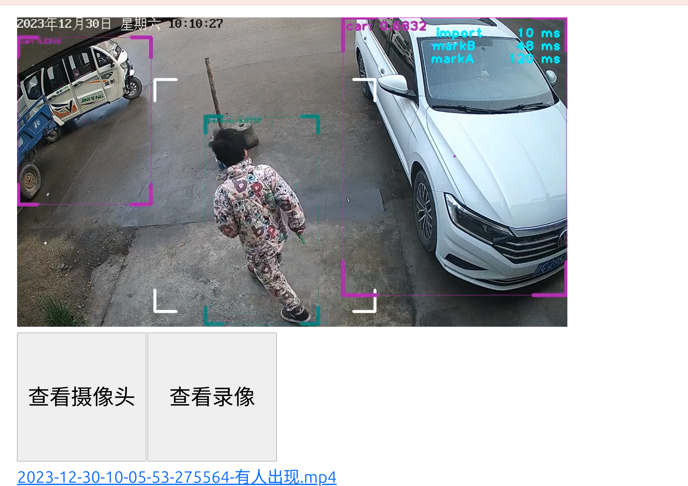

## 项目说明

家庭智能摄像头, 用于监控房屋门口, 可自动识别人员和车辆的出现, 并且驱赶停靠并遮挡门口的车辆.

## 样例



### 功能

- 监控指定区域行人与车辆的出现并自动录像
- 支持摄像头实时查看
- 历史录像查看
- 已接入 `海康SDK`, `海康网络摄像头` 当出现行人或车辆能够播放相应音频
    - 有人出现播放 `你好`
    - 有车辆出现播放报警音频 `车辆遮挡大门, 请离开`

## 依赖

- 系统: 仅支持 linux
- python 版本: >= 3.8
- 第三方软件: ffmpeg

## 快速开始

### Ubuntu

* 安装 ffmpeg

```shell
sudo apt install ffmpeg 
```

* 安装 pip

```shell
sudo apt install python3-pip 
```

* 安装 watchdog

```shell
pip install git+https://gitee.com/walkerjun/watchdog.git
```

* 查看 watchdog 帮助与版本

```shell
walkerjun@walkerjun-home:~$ watchdog --help
usage: watchdog [-h] [-V] [-port PORT] [-width WIDTH] [-height HEIGHT] [-active-fps ACTIVE_FPS] [-rest-fps REST_FPS] [-car-alart-secs CAR_ALART_SECS] [-cache-path CACHE_PATH]
                [-cache-days CACHE_DAYS]
                address

positional arguments:
  address               Camera address, like '/dev/video0' or 'rtsp://[username]:[password]@[ip]'

optional arguments:
  -h, --help            show this help message and exit
  -V                    print the version and exit
  -port PORT            API server port, default: 8000
  -width WIDTH          video width, like 1280
  -height HEIGHT        video_height, like 720
  -active-fps ACTIVE_FPS
                        the fps when object detected, default active_fps is os.cup_count() * 2
  -rest-fps REST_FPS    the fps when no object detected
  -car-alart-secs CAR_ALART_SECS
                        car detected alart time
  -cache-path CACHE_PATH
                        the path store the videos
  -cache-days CACHE_DAYS
                        the days cache videos
                        
walkerjun@walkerjun:~$ watchdog -V
0.0.15                        
```

* 启动 [以本机摄像头为例]

```
watchdog /dev/video0 
```

* 浏览器查看 [默认 8000 端口]
  [http://localhost:8000](http://localhost:8000)


